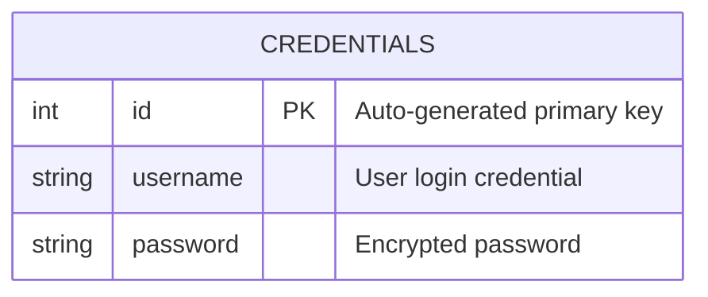
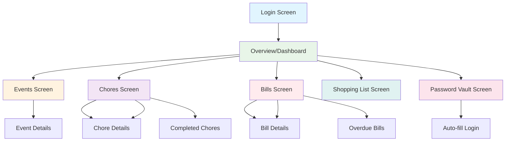

# FortTask - Household Management Android App

## 📱 Application Overview

FortTask is a comprehensive household management Android application built with Kotlin and Jetpack Compose. The app enables families and household members to efficiently organize their daily tasks, manage expenses, coordinate events, maintain shopping lists, and securely store credentials - all in one centralized platform.

### 🌟 Key Features

-   **📋 Chores Management**: Create, assign, and track household tasks with priority levels and due dates
-   **💰 Bills Tracking**: Monitor upcoming bills, due dates, and payment amounts with overdue notifications
-   **📅 Events Scheduling**: Plan and coordinate household events with attendee management
-   **🛒 Shopping Lists**: Collaborative shopping list creation with cost tracking
-   **🔐 Password Vault**: Secure local storage for credentials with quick login integration
-   **🏠 Multi-Household Support**: Support for multiple household environments
-   **🔄 Real-time Updates**: Live synchronization across devices using Socket.IO
-   **📱 Responsive Design**: Adaptive UI supporting both compact and expanded layouts

## 👥 Development Team

### 🔄 Division of Work

#### **Mateusz Gliszczynski** (`apozjebus`)

-   **Backend Integration**: Implemented fetching session along with JWT token
-   **Real-time Updates**: Developed Socket.IO integration for live updates
-   **Network Management**: Built robust networking components with error handling
-   **Local database**: Created database for storing loging keys
-   **Login Integration**: Implemented loging functionality with stored keys
-   **Navigation Menu**: Created menu for navigating through app

#### **Mateusz Borach** (`eWarzywo`)

-   **Backend Routing**: Implemented fetching API routes from web server
-   **UI/UX Architecture**: Designed and implemented the overall UI/UX architecture
-   **Screen Components**: Developed all major screen layouts (Overview, Chores, Bills, Events, Shopping List)
-   **Responsive Design**: Created adaptive layouts for different screen sizes
-   **Error Handling**: Implemented error handling and user feedback mechanisms
-   **Log Mechanisms**: Integrated Timber for structured logging and debugging

## 🏗️ Technical Architecture

### **Frontend Stack**

-   **Kotlin**: Primary programming language
-   **Jetpack Compose**: Modern declarative UI framework
-   **Material Design 3**: Consistent design system
-   **Navigation Compose**: Type-safe navigation
-   **Coroutines & Flow**: Asynchronous programming and reactive data streams

### **Backend Integration**

-   **Retrofit**: HTTP client for API communication
-   **Kotlin Serialization**: JSON serialization/deserialization
-   **Socket.IO**: Real-time bidirectional communication
-   **Authentication**: JWT-based secure authentication

### **Local Storage**

-   **Room Database**: Local SQLite database with type-safe queries
-   **SharedPreferences**: Lightweight data persistence
-   **Encrypted Storage**: Secure credential storage

### **Development Tools**

-   **Timber**: Structured logging framework
-   **KSP**: Kotlin Symbol Processing for Room
-   **Gradle Version Catalogs**: Dependency management

## 🗄️ Database Schema

### Local Database (Room)



### **Credentials Entity**

-   **Purpose**: Secure local storage of user login credentials
-   **Security**: Passwords stored with encryption
-   **Usage**: Quick login functionality and credential management

### Remote Database Entities (API Models)

#### **User Entity**

```kotlin
data class User(
    val id: Int,
    val username: String,
    val email: String?,
    val householdId: Int?,
    val createdAt: String?
)
```

#### **Chore Entity**

```kotlin
data class Chore(
    val id: Int,
    val name: String,
    val description: String,
    val dueDate: String,
    val priority: Int, // 1=Low, 2=Medium, 3=High, 4=Urgent
    val done: Boolean,
    val createdBy: CreatedBy?,
    val doneBy: CreatedBy?
)
```

#### **Bill Entity**

```kotlin
data class Bill(
    val id: Int,
    val name: String,
    val description: String,
    val amount: Double,
    val dueDate: String,
    val createdAt: String,
    val createdBy: CreatedBy?
)
```

#### **Event Entity**

```kotlin
data class Event(
    val id: Int,
    val name: String,
    val description: String,
    val date: String,
    val location: String,
    val attendees: List<Attendee>
)
```

#### **Shopping Item Entity**

```kotlin
data class ShoppingItem(
    val id: Int,
    val name: String,
    val cost: Double,
    val createdAt: String,
    val createdBy: CreatedBy?
)
```

## 🧭 Navigation Flow Schema



### **Navigation Structure**

#### **1. Authentication Flow**

-   **Login Screen**: Entry point with credential validation
-   **Auto-fill Integration**: Password vault integration for quick login
-   **Session Management**: Persistent authentication with secure token storage

#### **2. Main Navigation (Bottom Navigation Bar)**

-   **Overview/Dashboard**: Central hub with summaries of all features
-   **Events**: Calendar-based event management
-   **Chores**: Task management with filtering (Todo/Done)
-   **Bills**: Financial tracking with overdue notifications
-   **Shopping List**: Collaborative shopping management
-   **Password Vault**: Secure credential storage

#### **3. Screen-Specific Features**

**Overview Screen:**

-   Date selector with calendar integration
-   Quick summaries of upcoming events, chores, and bills
-   Recent shopping list items
-   Real-time data updates

**Chores Screen:**

-   Filter toggle (Todo/Completed)
-   Priority-based color coding
-   Due date tracking with overdue indicators
-   Assignment and completion tracking

**Bills Screen:**

-   Expandable bill cards with detailed information
-   Overdue bill highlighting
-   Amount formatting and due date calculations
-   Creation and modification tracking

**Events Screen:**

-   Chronological event listing
-   Location and attendee information
-   Date formatting and creation details
-   Real-time event updates

**Shopping List Screen:**

-   Cost calculation and formatting
-   Item addition with pricing
-   Creation date and user tracking

**Password Vault Screen:**

-   Secure credential storage
-   Quick login integration
-   Local encryption and data protection

## 🔄 Real-time Features

### Socket.IO Integration

-   **Live Updates**: Automatic data synchronization across devices
-   **Household Coordination**: Real-time updates for all household members
-   **Connection Management**: Automatic reconnection and error handling

### Update Callbacks

-   **Chores**: Instant updates when tasks are created, modified, or completed
-   **Events**: Real-time event creation and modification notifications
-   **Bills**: Live bill status updates and payment tracking

## 🛡️ Security Features

### **Authentication**

-   JWT-based secure authentication
-   Session management with automatic token refresh
-   Secure API communication with protected endpoints

### **Local Security**

-   Encrypted credential storage in Room database
-   Secure SharedPreferences for sensitive data
-   Local authentication for password vault access

## 🚀 Setup and Installation

### **Prerequisites**

-   Android Studio Hedgehog (2023.1.1) or later
-   Kotlin 1.9.0+
-   Android SDK 34+
-   Minimum Android API 34

### **Dependencies**

```kotlin
// Core Android
implementation 'androidx.core:core-ktx:1.12.0'
implementation 'androidx.lifecycle:lifecycle-runtime-ktx:2.7.0'
implementation 'androidx.activity:activity-compose:1.8.2'

// Jetpack Compose
implementation platform('androidx.compose:compose-bom:2024.02.00')
implementation 'androidx.compose.ui:ui'
implementation 'androidx.compose.material3:material3'
implementation 'androidx.navigation:navigation-compose'

// Database
implementation 'androidx.room:room-runtime:2.6.1'
implementation 'androidx.room:room-ktx:2.6.1'
kapt 'androidx.room:room-compiler:2.6.1'

// Networking
implementation 'com.squareup.retrofit2:retrofit:2.9.0'
implementation 'com.squareup.retrofit2:converter-gson:2.9.0'
implementation 'org.jetbrains.kotlinx:kotlinx-serialization-json:1.6.0'
implementation 'io.socket:socket.io-client:2.0.0'

// Logging
implementation 'com.jakewharton.timber:timber:5.0.1'
```

### **Installation Steps**

1. Clone the repository
2. Open in Android Studio
3. Configure `FULL_URL` in `gradle.properties` with your backend URL
4. Sync Gradle dependencies
5. Build and run on device/emulator

### **Configuration**

-   **Backend URL**: Set your API endpoint in build configuration
-   **Socket Connection**: Configure Socket.IO server endpoint
-   **Database**: Room database auto-initializes on first launch

## 🧪 Testing

The application includes comprehensive testing for:

-   **Unit Tests**: Core business logic and data models
-   **Integration Tests**: API communication and database operations
-   **UI Tests**: Screen navigation and user interactions

## 📈 Future Enhancements

-   [ ] Push notifications for overdue bills and upcoming events
-   [ ] Advanced calendar integration with external calendar apps
-   [ ] Photo attachments for chores and shopping items
-   [ ] Expense analytics and reporting
-   [ ] Multi-language support
-   [ ] Dark/Light theme customization
-   [ ] Offline mode with data synchronization
-   [ ] Voice input for quick task creation

## 🐛 Known Issues

-   Socket.IO reconnection may require app restart in some network conditions
-   Large shopping lists may experience minor performance impacts
-   Date formatting may vary based on device locale settings

## 📄 License

This project is developed as part of a mobile development course and is for educational purposes.

## 🤝 Contributing

This project was developed collaboratively by the team members listed above. For any questions or contributions, please contact the development team.

---

**Built with ❤️ using Kotlin & Jetpack Compose**
