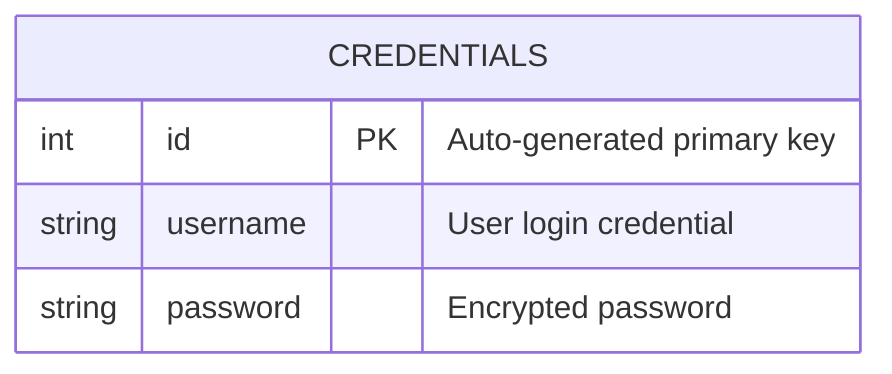
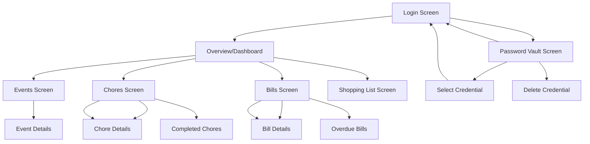

# FortTask - Household Management Android App

## 📱 Application Overview

FortTask is a comprehensive household management Android application built with Kotlin and Jetpack Compose. The app enables families and household members to efficiently organize their daily tasks, manage expenses, coordinate events, maintain shopping lists, and securely store credentials - all in one centralized platform.

> **📖 Read-Only Application**: This application is currently in read-only mode. Users can view and browse all household data (chores, bills, events, shopping lists) but cannot create, modify, or delete items through the mobile interface. Data modifications are handled through the backend system.

> **🌐 Web App Dependency**: This mobile app requires the **FortTask Web Application** for full functionality. The web app serves as the complete management platform where users can create, edit, and delete household data. This mobile app acts as a companion viewer for the web-based system.

**Last Updated**: May 2025  
**Version**: 1.0.0  
**Target SDK**: Android 34+

### 🌟 Key Features

-   **📋 Chores Management**: View and track household tasks with priority levels and due dates (read-only)
-   **💰 Bills Tracking**: Monitor upcoming bills, due dates, and payment amounts with overdue notifications (read-only)
-   **📅 Events Scheduling**: View and browse household events with attendee information (read-only)
-   **🛒 Shopping Lists**: View collaborative shopping lists with cost tracking (read-only)
-   **🔐 Password Vault**: Secure local storage for credentials with quick login integration and credential management
    -   Local encrypted storage using Room database
    -   Quick credential selection and auto-fill functionality
    -   Secure credential deletion with confirmation
    -   Material Design 3 card-based interface
    -   Easy navigation back to login screen with selected credentials
-   **🏠 Multi-Household Support**: Support for viewing multiple household environments
-   **🔄 Real-time Updates**: Live synchronization for data viewing across devices using Socket.IO
-   **📱 Responsive Design**: Adaptive UI supporting both compact and expanded layouts

## 👥 Development Team

### 🔄 Division of Work

#### **Mateusz Gliszczynski** (`apozjebus`)

-   **Backend Integration**: Implemented fetching session along with JWT token
-   **Real-time Updates**: Developed Socket.IO integration for live updates
-   **Network Management**: Built robust networking components with error handling
-   **Local Database**: Created database for storing loging keys
-   **Login Integration**: Implemented loging functionality with stored keys
-   **Navigation Menu**: Created menu for navigating through app

#### **Mateusz Borach** (`eWarzywo`)

-   **Backend Routing**: Implemented fetching API routes from web server
-   **UI/UX Architecture**: Designed and implemented the overall UI/UX architecture
-   **Screen Components**: Developed all major screen layouts (Overview, Chores, Bills, Events, Shopping List)
-   **Responsive Design**: Created adaptive layouts for different screen sizes
-   **Error Handling**: Implemented error handling and user feedback mechanisms
-   **Log Mechanisms**: Integrated Timber for structured logging and debugging

## 🏗️ Technical Architecture

### **Frontend Stack**

-   **Kotlin**: Primary programming language
-   **Jetpack Compose**: Modern declarative UI framework
-   **Material Design 3**: Consistent design system
-   **Navigation Compose**: Type-safe navigation
-   **Coroutines & Flow**: Asynchronous programming and reactive data streams

### **Backend Integration**

-   **Retrofit**: HTTP client for API communication
-   **Kotlin Serialization**: JSON serialization/deserialization
-   **Socket.IO**: Real-time bidirectional communication
-   **Authentication**: JWT-based secure authentication

### **Local Storage**

-   **Room Database**: Local SQLite database with type-safe queries
-   **SharedPreferences**: Lightweight data persistence
-   **Encrypted Storage**: Secure credential storage

### **Development Tools**

-   **Timber**: Structured logging framework
-   **KSP**: Kotlin Symbol Processing for Room
-   **Gradle Version Catalogs**: Dependency management

## 🗄️ Database Schema

### Local Database (Room)



### **Credentials Entity**

-   **Purpose**: Secure local storage of user login credentials for quick access
-   **Security**: Passwords stored with encryption in local Room database
-   **Usage**: Quick login functionality, credential management, and auto-fill integration
-   **Features**:
    -   CRUD operations with Repository pattern
    -   Lazy loading with efficient memory management
    -   Secure deletion with proper cleanup
    -   Integration with login screens via Navigation Component

### Remote Database Entities (API Models)

#### **User Entity**

```kotlin
data class User(
    val id: Int,
    val username: String,
    val email: String?,
    val householdId: Int?,
    val createdAt: String?
)
```

#### **Chore Entity**

```kotlin
data class Chore(
    val id: Int,
    val name: String,
    val description: String,
    val dueDate: String,
    val priority: Int, // 1=Low, 2=Medium, 3=High, 4=Urgent, 5=Critical
    val done: Boolean,
    val createdBy: CreatedBy?,
    val doneBy: CreatedBy?
)
```

#### **Bill Entity**

```kotlin
data class Bill(
    val id: Int,
    val name: String,
    val description: String,
    val amount: Double,
    val dueDate: String,
    val createdAt: String,
    val createdBy: CreatedBy?
)
```

#### **Event Entity**

```kotlin
data class Event(
    val id: Int,
    val name: String,
    val description: String,
    val date: String,
    val location: String,
    val attendees: List<Attendee>
)
```

#### **Shopping Item Entity**

```kotlin
data class ShoppingItem(
    val id: Int,
    val name: String,
    val cost: Double,
    val createdAt: String,
    val createdBy: CreatedBy?
)
```

## 🧭 Navigation Flow Schema



### **Navigation Structure**

#### **1. Authentication Flow**

-   **Login Screen**: Entry point with credential validation
-   **Auto-fill Integration**: Password vault integration for quick login
-   **Session Management**: Persistent authentication with secure token storage

#### **2. Main Navigation (Bottom Navigation Bar)**

-   **Overview/Dashboard**: Central hub with summaries of all features
-   **Events**: Calendar-based event management
-   **Chores**: Task management with filtering (Todo/Done)
-   **Bills**: Financial tracking with overdue notifications
-   **Shopping List**: Collaborative shopping management

#### **3. Screen-Specific Features**

**Overview Screen:**

-   Date selector with calendar integration
-   Quick summaries of upcoming events, chores, and bills (view-only)
-   Recent shopping list items display
-   Real-time data updates for viewing

**Chores Screen:**

-   Filter toggle (Todo/Completed) for viewing
-   Priority-based color coding display
-   Due date tracking with overdue indicators
-   Assignment and completion status viewing

**Bills Screen:**

-   Expandable bill cards with detailed information (view-only)
-   Overdue bill highlighting
-   Amount formatting and due date calculations
-   Creation and modification tracking display

**Events Screen:**

-   Chronological event listing (view-only)
-   Location and attendee information display
-   Date formatting and creation details
-   Real-time event updates for viewing

**Shopping List Screen:**

-   Cost calculation and formatting display (view-only)
-   Item viewing with pricing information
-   Creation date and user tracking display

**Password Vault Screen:**

-   Secure credential storage with local Room database
-   Material Design 3 elevated cards for credential display
-   Username display with masked password (••••••••)
-   Single-tap credential selection for auto-fill
-   Secure deletion with dedicated delete buttons
-   Empty state handling with user-friendly messaging
-   Navigation integration with savedStateHandle for data passing
-   Responsive layout with lazy loading for large credential lists

## 🔄 Real-time Features

### Socket.IO Integration

-   **Live Updates**: Automatic data synchronization across devices
-   **Household Coordination**: Real-time updates for all household members
-   **Connection Management**: Automatic reconnection and error handling

### Update Callbacks

-   **Chores**: Instant updates when tasks are created, modified, or completed
-   **Events**: Real-time event creation and modification notifications
-   **Bills**: Live bill status updates and payment tracking

## 🎯 Current Implementation Status

### ✅ Completed Features

-   **Password Vault System**: Fully implemented with secure local storage (full CRUD functionality)
-   **Material Design 3 UI**: Modern, responsive interface across all screens
-   **Navigation System**: Complete navigation flow with proper state management
-   **Real-time Updates**: Socket.IO integration for live data synchronization (read-only)
-   **Local Database**: Room database with encryption for secure data storage
-   **Authentication Flow**: JWT-based login with session management
-   **Data Viewing**: Complete read-only access to all household management data

### 🚧 Current Limitations

-   **Read-Only Mode**: The application currently operates in read-only mode for household data
-   **Data Modification**: Creating, editing, or deleting chores, bills, events, and shopping items is not available in the mobile app
-   **Web App Requirement**: Full functionality requires access to the FortTask Web Application for data management
-   **Backend Dependency**: All data modifications must be performed through the web-based interface
-   **Password Vault Exception**: Only the Password Vault feature supports full CRUD operations locally

### 🌐 FortTask Ecosystem

This mobile application is part of a larger FortTask ecosystem:

-   **🖥️ FortTask Web App**: Full-featured web application for complete household management
    -   Create, edit, and delete all household data
    -   Advanced administration and user management
    -   Complete CRUD operations for all features
    -   Primary data management interface
-   **📱 FortTask Mobile App** (this app): Companion viewing application
    -   Real-time data viewing and monitoring
    -   Secure credential storage and management
    -   Mobile-optimized interface for household data browsing
    -   Quick access to household information on-the-go

### 🚧 Development Architecture

The application follows clean architecture principles with:

-   **MVVM Pattern**: Clear separation between UI, business logic, and data layers
-   **Repository Pattern**: Centralized data management with local and remote sources
-   **Dependency Injection**: Structured dependency management
-   **State Management**: Reactive programming with Kotlin Flow and Compose State

## 🛡️ Security Features

### **Authentication**

-   JWT-based secure authentication
-   Session management with automatic token refresh
-   Secure API communication with protected endpoints

### **Local Security**

-   Encrypted credential storage in Room database
-   Secure SharedPreferences for sensitive data
-   Local authentication for password vault access

## 🚀 Setup and Installation

### **Prerequisites**

-   Android Studio Hedgehog (2023.1.1) or later
-   Kotlin 1.9.0+
-   Android SDK 34+
-   Minimum Android API 34

### **Dependencies**

```kotlin
// Core Android
implementation 'androidx.core:core-ktx:1.12.0'
implementation 'androidx.lifecycle:lifecycle-runtime-ktx:2.7.0'
implementation 'androidx.activity:activity-compose:1.8.2'

// Jetpack Compose
implementation platform('androidx.compose:compose-bom:2024.02.00')
implementation 'androidx.compose.ui:ui'
implementation 'androidx.compose.ui:ui-tooling-preview'
implementation 'androidx.compose.material3:material3'
implementation 'androidx.compose.material:material-icons-extended'
implementation 'androidx.navigation:navigation-compose'
implementation 'androidx.lifecycle:lifecycle-viewmodel-compose'

// Database
implementation 'androidx.room:room-runtime:2.6.1'
implementation 'androidx.room:room-ktx:2.6.1'
ksp 'androidx.room:room-compiler:2.6.1'

// Networking
implementation 'com.squareup.retrofit2:retrofit:2.9.0'
implementation 'com.squareup.retrofit2:converter-gson:2.9.0'
implementation 'org.jetbrains.kotlinx:kotlinx-serialization-json:1.6.0'
implementation 'io.socket:socket.io-client:2.0.0'

// Logging
implementation 'com.jakewharton.timber:timber:5.0.1'
```

### **Installation Steps**

1. **Clone the repository**

    ```bash
    git clone <repository-url>
    cd project-mobilki/forttask
    ```

2. **Open in Android Studio**

    - Launch Android Studio Hedgehog or later
    - Open the `forttask` folder as project

3. **Configure Backend URL**

    - Set `FULL_URL` in `gradle.properties` with your backend URL
    - Update Socket.IO server endpoints if needed

4. **Sync and Build**

    ```bash
    ./gradlew build
    ```

5. **Run on Device/Emulator**
    - Connect Android device or start emulator
    - Click Run or use `./gradlew installDebug`

### **Configuration**

-   **Backend URL**: Set your API endpoint in build configuration to connect to FortTask Web App backend
-   **Socket Connection**: Configure Socket.IO server endpoint for real-time updates
-   **Database**: Room database auto-initializes on first launch
-   **Web App Integration**: Ensure FortTask Web Application is deployed and accessible for full functionality

### **Requirements**

-   **FortTask Web Application**: Required for creating and managing household data
-   **Network Connection**: Required for real-time data synchronization
-   **Backend Server**: FortTask API server must be running and accessible

## 🤝 Contributing

This project was developed collaboratively by the team members listed above. The codebase follows modern Android development practices with Kotlin and Jetpack Compose.

### Development Guidelines

-   **Code Style**: Follow Kotlin coding conventions
-   **Architecture**: Maintain MVVM pattern and clean architecture
-   **Testing**: Include unit tests for business logic
-   **Documentation**: Update README for significant changes

## 📊 Project Statistics

-   **Language**: 100% Kotlin
-   **UI Framework**: Jetpack Compose with Material Design 3
-   **Architecture**: MVVM with Repository Pattern
-   **Database**: Room (Local) + REST API (Remote)
-   **Minimum SDK**: 34 (Android 15)
-   **Target SDK**: 34

---

**Built with ⚓ using Kotlin & Jetpack Compose**
